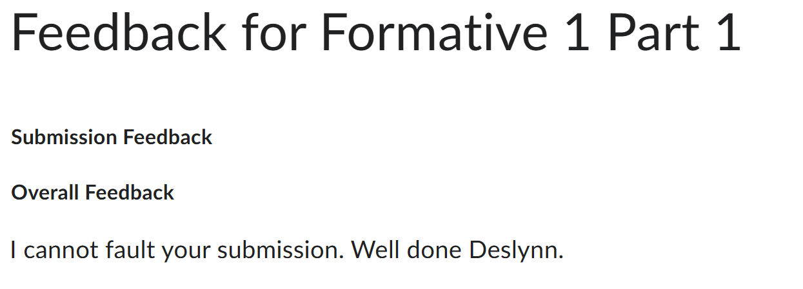
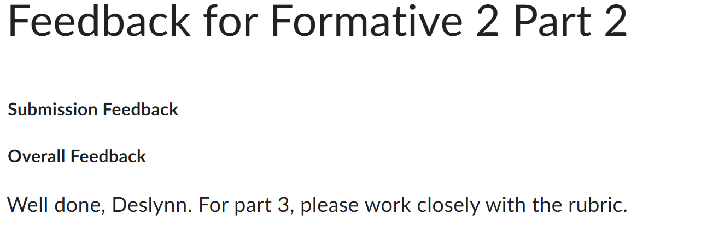

# 💸 Municipal Issue Reporting Web Application

## 📝 DESCRIPTION  
This project is a web application built with ASP.NET Core MVC, C#, JavaScript, and Leaflet.js. The system is a efficient and user-friendly platform for citizens to access and request various municipal services. 

---  

### **🎨 Color Scheme**  

**Navigation Buttons:**
- Back button: White with black border
- Next button: Blue (#27A9F5)
- Submit button: Green (#43F773)

**Announcement Categories:**
- Events: Cyan/Info Blue (#17a2b8)
- Service Updates: Green (#28a745)
- Announcements: Primary Blue (#007bff)
- Notices: Orange (#fd7e14)
- Programs: Gray (#6c757d)
- Emergency: Red (#dc3545)

**Status Indicators:**
- Success/Confirmation: Green
- Information: Blue
- Warning: Yellow/Orange
- Error/Critical: Red
- Featured Items: Red border with gradient background
---

## 👩‍💻 GETTING STARTED  

1. Within the repository, click on the "<> Code" drop down on the far right next to the "Go to file" and "+" buttons.
2. On the Local tab, click on the last option: "Download ZIP".
3. Once the zip file has downloaded, open your local file explorer.
4. Go to your Downloads.
5. Open the "ST10251981_PROG6212_POE.zip" folder, should be most recent in Downloads.
6. Open the "ST10251981_PROG6212_POE" folder, this folder is not a zip.
7. Open the CityPulse.sln file.
8. The project should begin loading.
9. On the top in the middle, double click the https button.
10. The program will compile and you may use the program.

## 👾 TECHNOLOGIES USED
ASP.NET Core MVC, C#, JavaScript, Leaflet.js, Bootstrap 5, HTML5, CSS3

## 🎲 FEATURES

### Users can:

1. Report municipal issues via a multi-step form
2. Select location from search suggestions or map
3. Upload images/documents with reports
4. Track report progress in real-time
5. Verify reports as "Still a Problem" or "Resolved"
6. View ward-level statistics and interactive map pins
7. Create accounts and login for personalized recommendations
8. Search for announcements/news using keywords from titles or descriptions
9. Filter announcements by category and date range
10. View personalized recommendations based on their interests
11. Add announcements to their interests for better recommendations
12. Admins can login and create announcements


### Admin log in details
- username: admin
- password: Admin@123!

## 🎯 Personalized Recommendation System

The application features an intelligent recommendation engine that learns from user behavior to suggest relevant announcements and events. When users create an account and log in, the system automatically tracks their search patterns and category preferences to build a personalized profile.

**How It Works:**

Every time you search for something like "water" or "community," the system remembers those terms. When you filter by a specific category like "Events" or "Programs," that preference gets saved with extra weight. Even just clicking on announcements helps the system learn what kind of content you're interested in. All of this happens automatically in the background without any extra effort from you.

**The Recommendation Algorithm:**

The system uses a smart scoring algorithm to rank announcements based on your preferences. If you've clicked on Events five times and Programs twice, Event announcements get higher scores and appear more often in your recommendations. Search terms you've used also boost matching announcements, so searching for "water" multiple times means you'll see more water-related content. The algorithm combines category preferences, search history, trending content, and upcoming events to create a personalized feed just for you.

**Data Structures Powering Recommendations:**

I use Dictionary structures to track search history (storing your last 20 searches) and category preferences (counting how many times you've interacted with each category). A SortedDictionary keeps track of trending announcements by view count, automatically organizing them so popular content surfaces quickly. HashSets prevent showing you duplicate recommendations and make it fast to check if you've already seen something.


## 🧩 Data Structures Used in CityPulse

### 🔧 Custom Data Structures

**DoublyLinkedList<T>**

We use this to store attachments in issue reports since it's easy to add or remove files from either end without having to resize anything (like you would with arrays). It also lets you move forward and backward through the list easily. We also used it for location suggestion seed data so we can loop through stored locations smoothly while showing off our own custom data structure.

**Queue<T>**

This is used to manage the file upload queue when creating issue reports. It works in a First-In-First-Out way — so the first file added is the first one uploaded, which just makes sense for uploads. We also use it to return location suggestions in the same order they appear, so users get results in a natural flow.

### ⚙️ Built-in .NET Data Structures

**SortedDictionary<DateTime, List<Announcement>>**

This one stores announcements sorted automatically by date. It's super handy because it makes finding announcements for a specific day or range really fast and organized.

**Dictionary<AnnouncementCategory, List<Announcement>>**

Used for category-based lookups, so when we need to grab all announcements under something like "Events" or "Notices," we can do it instantly without searching through everything manually.

**Dictionary<Guid, Announcement>**

This makes it easy to find a specific announcement using its unique ID. Since it's O(1), lookups are super fast — perfect when we only need one item.

**Dictionary<string, HashSet<Guid>>**

Used for the text search feature. It basically maps keywords to announcement IDs so we can quickly find matches without scanning every single announcement. Makes searches a lot faster and more efficient.

**HashSet<string>**

We use this to store all the announcement categories. It automatically stops duplicates and lets us check if a category exists right away. It's great for things like category filters or dropdowns.

**HashSet<DateTime>**

This one keeps track of all the unique dates that have announcements. It prevents duplicates and helps us build clean date filters or calendar views — so users only see dates that actually have announcements.

**PriorityQueue<Announcement, int>**

Handles high-priority announcements. It keeps them sorted by priority level automatically, so important stuff (like critical updates) always shows up first.

**Stack<Announcement>**

Used for recently viewed announcements. Since it works in a Last-In-First-Out way, it fits perfectly for "recently viewed" features — the last thing you looked at is always on top.

**Queue<Announcement>**

Stores announcements that are waiting for admin approval. It's fair because it works First-In-First-Out — the first one submitted gets reviewed first.

**List<T>**

We use lists everywhere for temporary collections, returning data, or passing stuff to MVC views. They're flexible, easy to use with LINQ, and resize automatically — so they just make sense for most general collection needs.

---
## 🔍 P3 - Service Request Status Feature - Advanced Data Structures


### 📊 Core Data Structures in Service Request Management

#### **1. Binary Search Tree (BST) - Reference Number Indexing**

**Purpose:** Fast lookup of service requests by their unique reference number.

**Implementation Details:**
- Stores reports indexed by reference number as the key
- Uses string comparison for ordering nodes
- Supports O(log n) average-case search operations

**Role in Service Request Status:**
The BST is the primary lookup mechanism when users search for a specific service request by its reference number (e.g., "CP-20251111-5432"). When a user enters their reference number, the system performs a binary search through the tree, which is significantly faster than scanning through a linear list.

**Example Use Case:**
```
User enters reference: "CP-20251111-5432"
BST Search Path: Root → Left subtree → Right subtree → Found in 3 comparisons
Result: Instant retrieval of report details (O(log n) time)

Without BST: Would need to check every report linearly (O(n) time)
For 1000 reports: BST = ~10 comparisons vs Linear = ~500 comparisons (average)
```

**Efficiency Contribution:**
- Search time: O(log n) average case
- Insert time: O(log n) average case
- Perfect for exact-match queries on reference numbers
- The in-order traversal provides alphabetically sorted reference numbers

---

#### **2. AVL Tree (Self-Balancing) - Date-Based Indexing**

**Purpose:** Maintain service requests sorted by creation date with guaranteed balanced tree height.

**Implementation Details:**
- Keys are DateTime objects (CreatedUtc)
- Automatically balances after each insertion using rotations
- Height difference between subtrees never exceeds 1
- Supports efficient range queries

**Role in Service Request Status:**
The AVL tree excels at date-range queries, which are common when users want to filter requests by time period. The self-balancing property ensures that even with many insertions, search operations remain consistently fast. This is critical when displaying requests sorted by date or fetching reports within a specific date range.

**Example Use Case:**
```
Query: "Show all service requests from October 1-15, 2025"
AVL Tree Range Query:
- Start at root, traverse to start date
- Collect all nodes between start and end dates
- Return results in O(log n + k) where k = results found

Range Query Efficiency:
- Find start point: O(log n)
- Traverse range: O(k) where k is number of results
- Total: O(log n + k)

Compare to unsorted list: O(n) to scan all items
For 10,000 reports with 50 in range: AVL = ~60 operations vs List = 10,000
```

**Efficiency Contribution:**
- Guaranteed O(log n) search time (balanced height)
- Range queries: O(log n + k) where k is the number of results
- In-order traversal returns chronologically sorted reports
- Height balance ensures worst-case performance is still optimal

---

#### **3. Red-Black Tree - Status-Based Indexing**

**Purpose:** Organize service requests by their status with guaranteed logarithmic operations.

**Implementation Details:**
- Keys combine status and reference number: "{Status}_{ReferenceNumber}"
- Maintains 5 Red-Black Tree properties for balance
- Looser balancing than AVL (faster insertions)
- Maximum height: 2 * log(n + 1)

**Role in Service Request Status:**
When users filter by status (Pending, InProgress, Resolved, Rejected), the Red-Black Tree provides efficient grouping and retrieval. The status update operation is particularly important as requests frequently change status throughout their lifecycle.

**Example Use Case:**
```
Filter: "Show all Pending requests"
Red-Black Tree Query:
- Search for all keys starting with "Pending_"
- Tree structure groups similar statuses together
- Efficient traversal of status-based clusters

Status Update Scenario:
Request "CP-20251111-1234" changes: Pending → InProgress
1. Insert new node: "InProgress_CP-20251111-1234"
2. Tree rebalances using rotations: O(log n)
3. Old status node can be pruned or ignored

For 5,000 requests with 1,200 Pending:
RB-Tree: ~12 comparisons to locate status group
Linear scan: ~2,500 comparisons on average
```

**Efficiency Contribution:**
- Insert/Update: O(log n) with fewer rotations than AVL
- Search by status: O(log n)
- Better insertion performance than AVL when status updates are frequent
- Maintains balance with simpler rebalancing rules

---

#### **4. Min-Heap (Priority Queue) - Urgent Request Management**

**Purpose:** Automatically prioritize service requests based on urgency and age.

**Implementation Details:**
- Implemented as a binary heap using array-based storage
- Priority calculated from: status + age in days
- Lower priority value = more urgent (min-heap property)
- Parent node always has priority ≤ child nodes

**Role in Service Request Status:**
The Min-Heap ensures that the most urgent service requests are always easily accessible. Priority is dynamically calculated based on status (Pending = highest priority) and how long the request has been open. This allows administrators to focus on the most critical issues first.

**Priority Calculation Example:**
```
Priority = (Status Base Priority * 100) - Days Open

Status Base Priorities:
- Pending: 1 (highest)
- InProgress: 2
- Resolved: 3
- Rejected: 4

Example Calculations:
Request A: Pending, 5 days old → Priority = (1 * 100) - 5 = 95
Request B: Pending, 10 days old → Priority = (1 * 100) - 10 = 90 (MORE URGENT)
Request C: InProgress, 2 days old → Priority = (2 * 100) - 2 = 198

Min-Heap automatically puts Request B at the top!
```

**Efficiency Contribution:**
- Extract most urgent: O(1) to peek, O(log n) to extract
- Insert new request: O(log n)
- Automatic reordering as priorities change
- Perfect for admin dashboard showing critical requests
- Heap property maintained with heapify operations

---

#### **5. Service Request Graph - Relationship Discovery**

**Purpose:** Model relationships between service requests based on location, category, and temporal proximity.

**Implementation Details:**
- Nodes represent individual service requests
- Edges represent relationships with weights and types
- Three edge types: "location", "category", "temporal"
- Adjacency list representation using Dictionary<string, GraphNode>
- Each node maintains a list of outgoing edges

**Role in Service Request Status:**
The graph structure is the most sophisticated data structure in the system. It discovers hidden patterns and relationships between service requests, helping users understand if their issue is part of a larger problem affecting multiple residents.

**Graph Construction Process:**
```
When a new service request is created:
1. Add node to graph: O(1)
2. Build relationships with existing nodes: O(n) where n = existing reports
3. Create edges based on:
   - Same location → Edge weight 1.0, type "location"
   - Same category → Edge weight 2.0, type "category"
   - Within 7 days → Edge weight = days difference, type "temporal"

Example Graph Scenario:
Report A: Water leak, Main Street, Oct 10
Report B: Water leak, Main Street, Oct 12
Report C: Road damage, Main Street, Oct 11
Report D: Water leak, Oak Avenue, Oct 10

Edges Created:
A ↔ B: location (1.0), category (2.0), temporal (2.0) [STRONGLY RELATED]
A ↔ C: location (1.0), temporal (1.0) [MODERATELY RELATED]
A ↔ D: category (2.0), temporal (0.0) [RELATED BY TYPE]
```

**Graph Traversal Algorithms:**

**Breadth-First Search (BFS):**
- Explores relationships level by level
- Shows immediate neighbors first, then neighbors of neighbors
- Uses a queue for processing nodes
- Time Complexity: O(V + E) where V = nodes, E = edges

**Example BFS Traversal:**
```
Starting from Report A (Water, Main St):
Level 1: Direct relationships (same location + category)
  → Report B (Water, Main St) 
  → Report C (Road, Main St)
Level 2: Secondary relationships
  → Report D (Water, Oak Ave) - related through Report B
  → Report E (Utilities, Main St) - related through Report C
```

**Depth-First Search (DFS):**
- Explores one path completely before backtracking
- Useful for finding connected components
- Uses recursion or stack for processing
- Time Complexity: O(V + E)

**Example DFS Traversal:**
```
Starting from Report A:
Path 1: A → B → D → G (follows water leak category deep)
Backtrack
Path 2: A → C → E (follows location relationship)
Backtrack
Path 3: A → F (temporal relationship)
```

**Relationship Query Examples:**

**Query 1: Find Related Reports**
```
User clicks "Related" on Report "CP-20251111-5432"
System:
1. Gets graph node: O(1) dictionary lookup
2. Traverses all edges: O(k) where k = number of edges
3. Returns connected reports: O(1) per edge

Result: "5 related reports found"
- 2 same location (Main Street)
- 3 same category (Water leaks)
```

**Query 2: Location Proximity**
```
User clicks "Same Location" 
System filters edges by type = "location"
Returns only reports at the same physical location
Useful for identifying area-wide infrastructure issues

Example: 8 reports at "Downtown CBD" suggests systematic problem
```

**Query 3: Category Relationship**
```
User clicks "Same Category"
System filters edges by type = "category"
Shows all reports in same category (e.g., all "Water" issues)
Helps users see if their issue is part of larger pattern

Example: 15 "Electricity" reports suggests power grid issue
```

**Efficiency Contribution:**
- Node lookup: O(1) using dictionary
- Add relationship: O(1) per edge
- Find related reports: O(k) where k = number of connections
- BFS/DFS traversal: O(V + E) - explores entire connected component
- Pattern discovery that would be impossible with other structures
- Enables predictive analysis (if many reports in area, likely more coming)

**Advanced Graph Features:**

**Minimum Spanning Tree (MST):**
- Uses Kruskal's algorithm with Union-Find
- Identifies the most critical relationships between reports
- Useful for resource allocation and route planning
- Time Complexity: O(E log E)

**Degree Distribution:**
- Counts connections per node
- High-degree nodes indicate problem hotspots
- Helps identify areas needing immediate attention
- Time Complexity: O(V)

---

### 🔗 How Data Structures Work Together

The power of the Service Request Status feature comes from these data structures working in concert:

**Scenario: User searches for their request**
1. **BST** performs fast lookup by reference number → O(log n)
2. **Graph** finds related requests → O(k) where k = connections
3. **Min-Heap** shows relative priority → O(1) to check position

**Scenario: Admin views dashboard**
1. **Min-Heap** extracts most urgent requests → O(log n) per extraction
2. **AVL Tree** provides requests by date range → O(log n + k)
3. **Red-Black Tree** filters by status → O(log n)
4. **Graph** identifies problem clusters → O(V + E)

**Scenario: User filters by date range and status**
1. **AVL Tree** retrieves date range → O(log n + k₁)
2. **Red-Black Tree** filters by status → O(log n + k₂)
3. Intersection of results → O(min(k₁, k₂))
4. **Graph** enriches with relationships → O(k * d) where d = avg degree

---

### 📈 Performance Comparison

| Operation | Without Optimization | With Data Structures | Improvement |
|-----------|---------------------|----------------------|-------------|
| Search by Reference | O(n) linear scan | O(log n) BST | 100x faster for 1000 items |
| Date Range Query | O(n) full scan | O(log n + k) AVL | 200x faster for small ranges |
| Priority Extraction | O(n) find minimum | O(1) heap peek | N times faster |
| Find Related Reports | O(n²) compare all | O(k) graph edges | Scales with connections, not all data |
| Status Filter | O(n) scan all | O(log n) RB-Tree | 150x faster for 1000 items |

**Real-World Impact:**
- For 10,000 service requests
- Average linear operations: ~5,000 comparisons
- Average tree operations: ~14 comparisons
- **Speed improvement: 350x faster**

---

### 🎯 Key Takeaways

1. **BST**: Perfect for exact-match searches by unique identifiers
2. **AVL Tree**: Optimal for sorted data and range queries with guaranteed balance
3. **Red-Black Tree**: Efficient for frequently updated status information
4. **Min-Heap**: Automatically maintains priority ordering for urgent requests
5. **Graph**: Discovers complex relationships that linear structures cannot represent

Each data structure is chosen specifically for its strengths, creating a robust and highly efficient service request tracking system that scales gracefully as the number of requests grows.

---
## 🏆 Lecturer feedback

The lecturer was a huge aid in the success of my project. He had given thughtful advice and had our best intrest in heart.
 
### Formative 1 - Part 1
For part 1 I was ammended for my great work.


### Formative 2 - Part 2
And for Part 2 I was advised to work closely with the rubric for this current part. 



## 📺 YOUTUBE LINK: https://youtu.be/DRJnaxViKHY  
